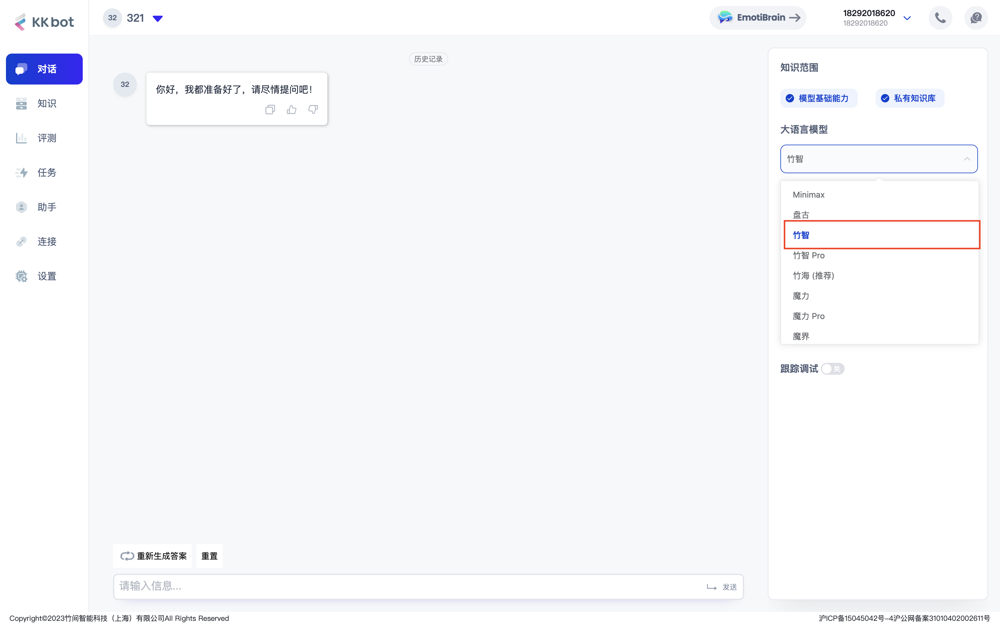
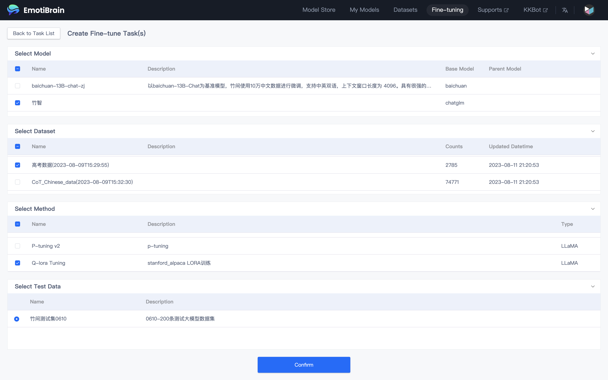
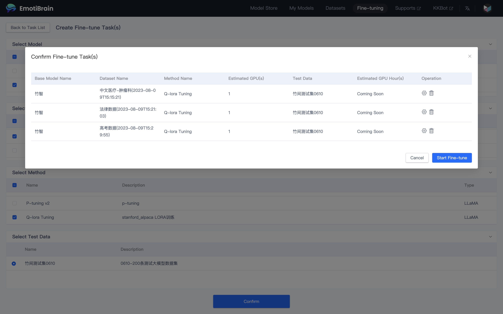

# README

# Zhuhai-13B

[Hugging Face](https://huggingface.co/emotibot-inc/Zhuhai-13B) | [GitHub](https://github.com/emotibot-inc/Zhuhai-13B) | [Model Scope](https://modelscope.cn/models/emotibotinc/Zhuhai-13B/summary) | [Emotibrain](https://brain.emotibot.com/?source=zhuhai13b_github)

# **模型介绍**

"竹海-13B"是竹间智能继“竹海-7B”之后开发的一款拥大模语言模型，以下是“竹海-13B”的四个主要特点： 

- 更大尺寸、更多数据：相比于“竹海-7B”，我们将参数量扩大到130亿，并在高质量语料上训练了1.2万亿tokens。Zhuhai-13B的上下文窗口长度为4096。

- 高效性能：基于Transformer结构，在大约1.2万亿tokens上训练出来的130亿参数模型，支持中英双语。

- 安全性：我们对“竹海-13B”进行了严格的安全控制和优化，确保其在实际应用中不会产生任何不适当或误导性的输出。通过精心设计和调整算法参数，“竹海-13B”可以有效地避免乱说话现象。

# **推理对话**

您可以直接注册并登录竹间智能科技发布的大模型产品 [Emotibrain](https://brain.emotibot.com/?source=zhuhai13b_github)，并选择 **CoPilot**（**KKBot**） 进行的在线测试，注册即可立即使用；

# **模型训练**

您可以直接注册并登录竹间智能科技发布的大模型产品 [Emotibrain](https://brain.emotibot.com/?source=zhuhai13b_github)，并选择 Fine-tune 进行 **0 代码微调**，注册即可立即使用；

详细的训练流程您可以浏览此文档：[Emotibrain 快速入门](https://brain.emotibot.com/supports/model-factory/dash-into.html)（大约 5 分钟）

# **更多信息**

若您想了解更多 大模型训练平台 的相关信息，请访问 [Emotibrain 官网](https://brain.emotibot.com/?source=zhuhai13b_github) 进行了解；